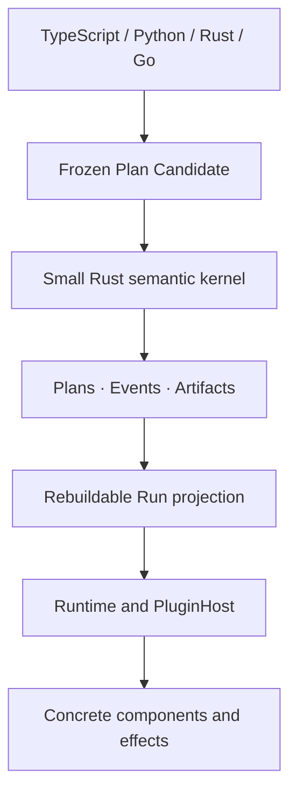

# Cymule

Cymule is a small, Rust-first framework for defining and executing durable,
effectful programs from TypeScript, Python, Rust, and Go.

Write a Flow once, keep its meaning independent from infrastructure, and run it
through replaceable components and effect plugins. Cymule gives every Plan,
state transition, and external effect a stable identity so retries, worker
upgrades, ambiguous outcomes, and replay can be handled explicitly.

> **Project status:** version `0.1.0` is an executable Embedded M0 framework and
> semantic reference implementation. It is ready for local execution,
> integration work, and conformance testing. Persistent crash recovery and a
> distributed production runtime are roadmap work.

## What Cymule gives you

- **One Flow format across languages.** TypeScript, Python, Rust, and Go SDKs
  produce the same frozen `cymule.ir/1` Plan.
- **Stable program identity.** Validated Plans are canonicalized and assigned a
  content-addressed `PlanId`.
- **Safe command retries.** Repeating the same command returns the original
  receipt; reusing its ID for different work fails.
- **Stale-worker protection.** Attempts are fenced by an epoch, so an older
  worker cannot commit after ownership changes.
- **Honest external effects.** A timeout after dispatch becomes `unknown`, not
  an automatic duplicate operation.
- **Explicit reconciliation.** An ambiguous effect is resolved through its
  original identity, arguments, and plugin binding.
- **Replaceable integrations.** Plans name abstract operations rather than
  queues, object stores, vendors, endpoints, or credentials.
- **Deterministic state replay.** Canonical Events rebuild the same Run
  projection and digest.

## When to use Cymule

Cymule is designed for programs that may outlive one process or implementation:

- agent and tool workflows with externally visible actions;
- long-running automation with signals, timers, or human input;
- operations that need approval, auditability, or safe retry behavior;
- systems that must change workers or providers without reinterpreting history;
- compiler or SDK frontends that need one language-neutral execution contract;
- runtime research that needs executable semantics rather than scheduler-specific
  behavior.

Cymule is probably not the right layer for a short, pure function or a normal
request/response handler with no durable state or external side effects.

## Five-minute quick start

The complete repository verification requires Rust 1.97, Node.js 22 or newer,
pnpm 11.17, Python 3.12 or newer with `uv`, and Go 1.26. MLIR is optional.

Build the Rust engine and the included test plugin:

```sh
cargo build -p cymule-cli -p cymule-test-adapter
```

Seal the example Flow into an immutable Plan:

```sh
./target/debug/cymule seal \
  --input tests/fixtures/cross-language-plan.json \
  > /tmp/cymule-plan.json
```

Execute the Plan:

```sh
printf '{"message":"hello from Cymule"}\n' > /tmp/cymule-input.json

./target/debug/cymule run \
  --plan /tmp/cymule-plan.json \
  --input /tmp/cymule-input.json \
  --plugin ./target/debug/cymule-test-adapter \
  --run-id run:readme-example
```

The result contains the Run and Plan identities, returned value, projection
digest, current precondition token, and structurally identified effects:

```json
{
  "run_id": "run:readme-example",
  "plan_id": "sha256:d29d444a5e4c3b703d4f186a8f463fe1d501d7245b9ad827656686a21b47be62",
  "value": { "message": "hello from Cymule" },
  "projection_digest": "...",
  "precondition_token": "pre:0:...",
  "effects": ["sha256:..."]
}
```

Run every language SDK and semantic conformance test:

```sh
./scripts/verify.sh
```

## Author a Flow

A Flow declares contracts and semantic steps. It does not select a concrete
provider.

This TypeScript example calls an abstract echo component, stages a mutating
capture effect, and returns the component result:

```ts
import {
  CliEngine,
  FlowBuilder,
  type EffectProfile,
} from "@cymule/sdk";

const captureProfile: EffectProfile = {
  mutation: "mutating",
  dispatch: "on_scope_commit",
  reconciliation: "queryable",
  keyed_idempotency: true,
  irreversible: false,
};

const candidate = new FlowBuilder("echo_and_capture", {}, {})
  .component("example.echo", {}, {})
  .effectContract("example.capture", {}, {}, captureProfile)
  .call("call.echo", "example.echo", { kind: "input" }, "echoed")
  .effect(
    "effect.capture",
    "example.capture",
    { kind: "binding", name: "echoed" },
    "primary",
  )
  .finish({ kind: "binding", name: "echoed" });

const engine = new CliEngine("./target/debug/cymule");
const plan = engine.seal(candidate);
const result = engine.run(
  plan,
  { message: "hello" },
  "./path/to/example-plugin",
  "run:example",
);
```

The Python, Rust, and Go SDKs expose the same concepts with idiomatic builders.
All four SDKs send Plan Candidates to the Rust engine; none implements a second
canonicalizer or state reducer.

Version `0.1.0` keeps the SDK packages in this repository for source/workspace
consumption. Publishing to public language package registries is not part of
the current release.

## The programming model

The public model is intentionally small:

```text
Flow -> Run -> Result

Inside a Flow: call | wait | effect | scope
```

| Operation | Use it for |
| --- | --- |
| `call` | Calling an abstract component and binding its typed result. |
| `wait` | Suspending for a signal, timer, or typed external input. |
| `effect` | Performing an observation or a world-mutating action. |
| `scope` | Grouping state/evidence decisions and controlling effect release. |

A `Run` is the live handle. It can accumulate state, history, waits, and effect
obligations before it produces a terminal `Result`.

## How Cymule handles failures

| Situation | Cymule behavior |
| --- | --- |
| A command is delivered twice | The same command ID and semantics return the original receipt. |
| A command ID is reused for different work | The command is rejected. |
| The Run changed after a UI or worker read it | The stale precondition returns a typed conflict and the current token. |
| An old Attempt finishes after an epoch change | Its output is fenced and rejected. |
| A scope aborts before effect release | Its unreleased mutating effects are cancelled. |
| Dispatch starts but the response is lost | The effect becomes `unknown`. |
| An unknown effect can be queried | The original effect is reconciled without creating a new intent. |
| Required replay data has been removed | Replay availability is downgraded instead of silently regenerating data. |

## Effects are not ordinary retries

An external operation has three independent states:

```text
control:        admitted -> prepared -> release_authorized -> dispatch_started
world outcome:  unobserved | applied | not_applied | unknown
reconciliation: not_required | pending | resolved | governance_required
```

If a network timeout happens after dispatch, Cymule does not know whether the
external world changed. Retrying as a new operation could duplicate a payment,
message, deployment, or tool action. Cymule therefore records `unknown` and
keeps reconciliation attached to the original effect identity.

When a scope commits, it commits the internal decision and transfers unresolved
world actions into effect obligations. It does not pretend those actions are
already settled. Blocking obligations must reach an authoritative terminal
outcome before the Run can complete.

## Plans stay portable

Cymule separates program meaning from concrete realization:

```text
Plan                              Binding and plugin
--------------------------------  ---------------------------------
stable sites and operation IDs    implementation identity
input/output schemas              implementation revision
effect safety properties          credentials and endpoints
scope and result structure        worker and deployment topology
```

A Binding Context supplies defaults for future occurrences. An admitted
Attempt or Effect keeps its original occurrence binding even when defaults
change. This makes worker upgrades, canaries, and provider migration possible
without rewriting history.

Plans should name abstract operations such as `document.read` or
`notification.send`. Concrete databases, buckets, queues, model vendors,
credentials, and network endpoints belong behind plugins or runtime substrate
interfaces.

## Architecture at a glance



Only `cymule-core` owns canonical identity, command admission, transition laws,
and replay. It performs no network, filesystem, clock, random, model, tool,
queue, or database I/O.

The framework has three canonical authorities:

1. immutable, content-addressed Plans;
2. admitted causal Events;
3. immutable typed Artifacts.

Current Run state, ready-work queues, graphs, indexes, and attention views are
rebuildable projections rather than competing sources of truth.

See [Architecture](docs/architecture.md) and the
[Semantic specification](docs/specification.md) for the detailed design.

## SDK and tooling support

| Surface | Status | Notes |
| --- | --- | --- |
| Rust SDK | Implemented | Native builder, typed contracts, and `Engine` trait. |
| TypeScript SDK | Implemented | Builder and CLI-backed engine client. |
| Python SDK | Implemented | Dependency-light builder and engine client. |
| Go SDK | Implemented | Builder and engine client. |
| Process plugin protocol | Implemented | JSON request/response reference transport. |
| JSON Schema contracts | Implemented | Draft 2020-12 Plan and protocol schemas. |
| MLIR workbench | Partial | Generic-operation syntax and MLIR 22 smoke validation. |

The process protocol is intentionally simple and useful for local integration.
It is not the only possible production transport. Future WIT or network
transports can implement the same `PluginHost` behavior.

## Current capabilities and limits

Version `0.1.0` implements the bounded Semantic Interpreter M0 and Embedded M0
profiles.

Implemented today:

- frozen IR validation and canonical Plan IDs;
- in-memory Plan, Event, and Artifact stores;
- typed Commands, idempotency, and stale-action preconditions;
- causal state replay and projection digest verification;
- Attempt epoch fencing;
- scope, effect, obligation, and reconciliation state machines;
- future-default binding updates with pinned Attempt and Effect bindings;
- one-shot process plugins and four SDK execution chains;
- `wait` authoring and a suspension boundary.

Not yet claimed:

- persistent crash recovery and durable wait resumption;
- a persisted complete continuation object;
- exact execution replay of unrecorded component outputs;
- distributed ownership, consensus, scheduling, and failover;
- strong untrusted-code or multi-tenant isolation;
- provider-level exactly-once guarantees;
- a registered MLIR dialect and deterministic MLIR-to-Plan lowering.

M0 proves exact canonical **state replay** over retained Events and required
Artifacts. It does not claim exact execution replay or distributed durability.
The distinction is intentional and tested.

See [Conformance](docs/conformance.md) for precise profile claims and
[Roadmap](docs/roadmap.md) for the implementation sequence.

## Repository layout

```text
crates/cymule-core      trusted Rust semantic kernel
crates/cymule-runtime   embedded interpreter and plugin host
crates/cymule-sdk       native Rust authoring and engine facade
crates/cymule-cli       command-line and JSON engine boundary
sdk/typescript          TypeScript SDK
sdk/python              Python SDK
sdk/go                  Go SDK
schemas                 frozen JSON Schema contracts
compiler/mlir           optional, partial MLIR workbench
plugins/test-adapter    deterministic conformance plugin
tests                   shared fixtures and conformance assets
docs                    specification, architecture, and decisions
scripts                 complete repository verification
```

## Learn more

- [Semantic specification](docs/specification.md) — canonical objects,
  Commands, scopes, effects, bindings, and replay.
- [Architecture](docs/architecture.md) — trust boundary, compiler/runtime split,
  plugins, and durable storage interfaces.
- [Conformance](docs/conformance.md) — implemented profiles and fault-oriented
  test cases.
- [Research landscape](docs/research-landscape.md) — similarities and deliberate
  differences from maintained execution systems and standards.
- [Roadmap](docs/roadmap.md) — durable execution, agent integration, large
  virtual work, live evolution, isolation, and formalization.
- [ADR 0001](docs/decisions/0001-small-rust-kernel.md) — why the authoritative
  kernel is small and Rust-first.
- [ADR 0002](docs/decisions/0002-mlir-outside-core.md) — why MLIR stays outside
  the runtime core.

## Contributing

Read [CONTRIBUTING.md](CONTRIBUTING.md) and the nearest `AGENTS.md` before making
changes. A semantic change must update its version-domain decision,
specification, schemas, conformance tests, and affected SDK fixtures together.

Report security issues through the private process in
[SECURITY.md](SECURITY.md).

## License

Licensed under either the Apache License, Version 2.0 or the MIT License, at your
option.
