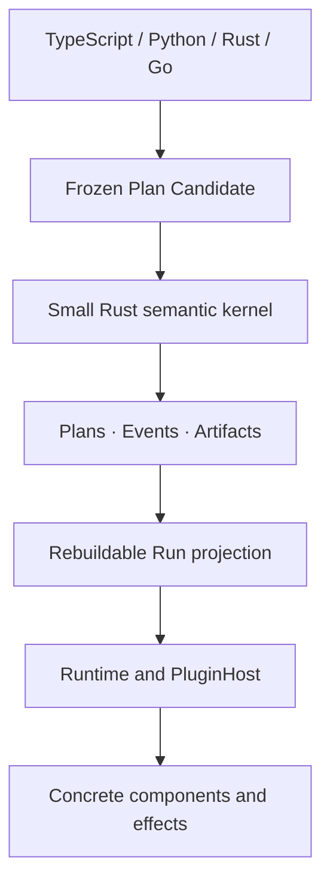

# Cymule

[](https://github.com/cymule-framework/cymule/actions/workflows/ci.yml)

Cymule is a semantic execution fabric for programs that must remain correct
across suspension, retries, external side effects, worker changes, historical
replay, and live evolution.

Its purpose is to keep one live computation coherent when durability,
transactional state, ambiguous world effects, authority, replay and historical
forks, large virtual work, and live Plan evolution interact. Cymule's central
runtime object is a **versioned effectful continuation**: durable,
version-bound execution state that carries Plan identity, typed frame/state,
waits, scope, epoch, execution fence, and at most one active driver claim.
Effect obligations, coordination leases, budget, and causal position remain in
their owning Machine or durable-profile authority and are derived together for
an exact-head quiescence decision.

The public model stays deliberately small - `Flow -> Run -> Result`, with
`call / wait / effect / scope` inside a Flow and `observe / decide / change`
around a Run. Under that facade, immutable Plans, causal Events, and Artifacts
are the only canonical truth; graphs, frontiers, schedulers, and debugger views
are rebuildable projections. Languages, databases, queues, sandboxes,
providers, and deployment topologies remain replaceable realizations rather
than framework semantics.

> **Project status:** the current unreleased tree is a **partial terminal
> candidate** for the complete single-domain execution profile: durable
> suspension and recovery, honest effect handling, bounded virtual work, safe
> live evolution, and an optional Agent interaction plugin. Those terminal
> paths are source-implemented and have passed multiple focused gates, but the
> exact source generation is still changing under review and its final frozen
> full gate is validation pending. No release tag, package publication,
> operator migration, or deployment exists for this candidate; code presence
> is not published or production evidence. Cymule is not a distributed
> consensus system or an untrusted-code isolation boundary. See the
> [conformance status](docs/conformance.md#status-ladder) and
> [roadmap](docs/roadmap.md) for the promotion gates and separate future
> profiles.

## What Cymule gives you

- **One Flow format across languages.** TypeScript, Python, Rust, and Go SDKs
  produce the same frozen `cymule.ir/3` Plan, including reusable definition
  declaration and invocation.
- **Stable program identity.** Validated Plans are canonicalized and assigned a
  content-addressed `PlanId`.
- **Closed Engine correlation.** Every Engine v5 success echoes the complete
  inner request the strict decoder executed, and SDKs compare it with their
  actual sent wire before accepting the response. Failures have no request echo
  because decoding itself may fail; predecessor success shapes are
  rejected.
- **Safe command retries.** Repeating the same command returns the original
  receipt; reusing its ID for different work fails.
- **Stale-worker protection.** Provider Attempts carry an execution fence that
  is separate from semantic occurrence identity, so an older driver cannot
  commit after ownership changes.
- **Identified durable wake-ups.** Signal and timer deliveries carry stable
  activation identities, so redelivery is idempotent and consume-once winners
  are decided by durable CAS rather than worker timing.
- **Honest external effects.** A timeout after dispatch becomes `unknown`, not
  an automatic duplicate operation.
- **Explicit reconciliation.** An ambiguous effect is resolved through its
  original identity, arguments, and plugin binding.
- **Portable resources between Runs.** Pass inline text/JSON/bytes, large
  objects, directories, collections, sandbox snapshots, remote-drive items, or
  public URLs through one versioned Resource Handle without choosing a storage
  provider in the framework.
- **Replaceable integrations.** Plans name abstract operations rather than
  queues, object stores, vendors, endpoints, or credentials.
- **Deterministic state replay.** Exact command records, receipts, admissions,
  and canonical Events rebuild the same Run projection and digest.
- **Safe reusable evolution.** Logical module references follow the newest
  compatible revision by default when a new Plan is linked, while every sealed
  Plan and admitted occurrence remains immutable and replayable.

## When to use Cymule

Cymule is designed for programs that may outlive one process or implementation:

- agent and tool workflows with externally visible actions;
- long-running automation with signals, timers, or human input;
- operations that need approval, auditability, or safe retry behavior;
- systems that must change workers or providers without reinterpreting history;
- compiler or SDK frontends that need one language-neutral execution contract;
- runtime research that needs executable semantics rather than scheduler-specific
  behavior.

Cymule is probably not the right layer for a short, pure function or a normal
request/response handler with no durable state or external side effects.

## Optional Agent integration

Cymule does not define an Agent Loop, Session model, message stream, model/tool
turn, or wire protocol. Those are application-domain concerns. The separately
owned [`plugins/agent-interaction`](plugins/agent-interaction/README.md) package
shows how an Agent integration can lower Session updates, input waits, host
occurrences, workspace changes, and finalized streams onto generic Cymule waits,
effects, resources, and typed durable profile controls. ACP, MCP, A2A, editor, and
provider support belongs in additional plugins above that package, not in
framework core, CLI, or SDK semantics.

## Official plugins

The current source candidate includes a day-one adapter set without making any
provider canonical:

- SQLite and atomic-directory durable stores;
- content-addressed filesystem and Apache `object_store` Resources;
- acknowledgement-coupled HTTP signals and durable logical timers;
- an exact-generation, restart-monotonic Clock receipt ledger with current-head
  execution admission, exact historical replay, and lease/scheduling
  observations;
- a bounded process executor;
- composable OpenTelemetry/OTLP observation;
- official RMCP tool mapping above the optional Agent contracts.

Every adapter is an independent crate with focused fault and boundary tests.
See the [official plugin catalog](docs/plugins.md) for exact guarantees,
limitations, mature dependencies, and the RocksDB assessment.

## How live evolution works

**Implementation status:** source-implemented as a partial terminal candidate;
validation pending. Multiple focused profile gates have passed, but branch-wide
verification, version-domain closure, and independent review must be rerun on
one final frozen source generation before it can become a validated source
candidate. Package and release evidence do not exist for this candidate.

Application source can reference a reusable module with
`latest_compatible` (the default) or pin one exact revision. `latest` is an
authoring convenience, never a runtime pointer:

1. Cymule resolves the complete acyclic module dependency closure.
2. It records every selected revision and seals them into a new immutable Plan.
3. Publishing a compatible leaf revision relinks affected future parent Plans;
   a newly reachable component, effect, wait, capability, or authority
   requirement blocks automatic takeover and retains the prior head.
4. Existing Runs and occurrences keep their original Plan; history is not
   rewritten.
5. New work can advance through shadow, deterministic canary, promotion, or
   rollback decisions backed by immutable observations.

When state must cross Plan versions, Cymule derives a content-addressed proof
from a coordinator-owned exact-domain preflight: the durable Continuation is
ready, root-scoped, and framed, with no pending wait, pending/claimed/unknown
outbox entry, nonterminal Effect, unresolved blocking obligation, active
Attempt, active effect-dispatch claim lease, or open nested scope. The final CAS
consumes that same exact-head receipt. A coordination lease owns only its
coordination resource and fence; it grants no capability authorization. A
pinned migration plugin supplies the transformed Artifact and evidence only
after that proof matches durable authority. An explicit
`restart_under_new_plan` authorization can instead start a distinct replacement
Run under an exact Plan without reinterpreting old state.
Shadow execution,
metrics, deployment, and traffic movement are also replaceable plugins; Cymule
owns only their contracts, immutable receipts, and deterministic admission
rules. TypeScript, Python, Rust, and Go expose the same
`cymule.evolution-control/5` transport commands without duplicating the Rust
controller. Stateful live-evolution control changes use only `cymule.engine/5`
and return one complete receipt with the exact journal, submitted command, and
original outcome. An exact retry returns that outcome while preserving the
latest visible journal state; reusing an ID for different work fails before
migration or shadow plugin I/O. Engine v4 and live-evolution checkpoint v4 have
no compatibility fallback.

## Five-minute source-checkout quick start

Imagine a team evaluating hundreds of support cases through a model, Agent, or
rules engine. The run is expensive and may last for hours. Halfway through:

- a worker process crashes;
- the team ships a better scoring policy;
- a later policy change is incompatible with the running evaluation.

Without durable, versioned execution, the team must choose between repeating
expensive completed work, maintaining its own recovery database, or accepting
results whose meaning changed halfway through the run.

Cymule keeps completed work, applies a compatible update only to work that has
not started, and rejects an incompatible update before it changes the run. The
API below describes the current unreleased source generation. Build that exact
checkout instead of attributing it to an older registry version:

```sh
git clone https://github.com/cymule-framework/cymule.git
cd cymule
cargo build -p cymule-cli -p cymule-test-adapter
pnpm --dir sdk/typescript install --frozen-lockfile
pnpm --dir sdk/typescript run build
cat > quickstart.mjs <<'EOF'
import { CliEngine, FlowBuilder } from "./sdk/typescript/dist/src/index.js";

const candidate = new FlowBuilder("hello", {}, {})
  .component(
    "example.echo",
    {},
    {},
    "cymule.component-output/1",
    { capability: "echo" },
  )
  .call("call.echo", "example.echo", { kind: "input" }, "message")
  .finish({ kind: "binding", name: "message" });

const plan = await new CliEngine("./target/debug/cymule").seal(candidate);
console.log(plan.plan_id);
EOF
node quickstart.mjs
```

The command prints the content-addressed Plan ID produced by the same-checkout
Rust engine. Applications bind their own immutable process plugin and use
`DurableEngine` for real
`observe_clock`, `start`, `get`, `resume`, `takeover`, `signal`, `release`,
`cancel`, and `evolve` calls; SDKs never reduce durable state locally.
The local CLI executes registry, relink, rollout, observation, gate, pin, and
restart evolution operations. Migration and shadow variants require a
separately bound adapter/driver transport and fail closed when the local CLI has
no such binding.

The repository's larger evaluation demo runs real work, stops the worker after
three results, upgrades the scoring policy, resumes the evaluation, and tries
an unsafe update:

Expected tour output after the example gate passes:

```text
Cymule: safely upgrade a running evaluation

Scenario        Evaluate 12 support tickets while the scoring policy changes.
Crash recovery  The worker stopped after 3 results; restart reused all 3.
Safe upgrade    3 completed results kept the original policy;
                9 future results used the update.
Compatibility   An incompatible scoring update was blocked before it changed work.
Outcome         12/12 finished without repeating completed evaluations.
```

What this gives an application:

- **No repeat after a committed result.** A completed component occurrence is
  replayed after restart, and terminal virtual work resumes from its retained
  boundary. If a legacy component returned before its result CAS committed,
  expiry-proven takeover creates a later fenced Attempt for the same semantic
  occurrence and may repeat provider cost. Provider observations should use an
  observational Effect or an integration-owned identified occurrence.
- **Comparable historical results.** Every result keeps the exact program and
  policy that produced it, so an upgrade cannot rewrite history.
- **Safe changes during long-running work.** Compatible updates can serve new
  work immediately; incompatible changes fail before silently taking over.
- **Replaceable execution.** The evaluator can be a model gateway, Agent,
  script, sandbox, or remote service without moving its internal loop into the
  framework.
- **Provider-neutral recovery.** The application is not coupled to a particular
  queue, database, object store, or model provider.

The bundled evaluator is deterministic, so the tour needs no account, model,
network service, or container.

The command prints the retained state directory. The
[campaign guide](examples/durable-evaluation-campaign/README.md) expands each
phase into individual commands, and its
[adversarial review](examples/durable-evaluation-campaign/ADVERSARIAL_REVIEW.md)
documents the crash and integrity boundaries.

To see how Cymule avoids repeating an external action when the provider applies
it but its response is lost, run:

```sh
cargo run -p cymule-example-hello-world -- Ada --unknown-once
```

The example checks what happened to the original action instead of blindly
sending it again.

No published package or release tag carries this terminal source candidate.
Published packages may therefore expose an older generation; check the
registry's exact versioned API before embedding a published facade or CLI:

```sh
cargo search cymule
npm view cymule version
```

## Development

Contributors should first select the smallest conservative suite for their
change:

```sh
python3 scripts/test_harness.py plan --base origin/main
```

Profile claims and release changes run every required SDK and semantic
conformance family with:

```sh
./scripts/verify.sh
```

## Author a Flow

A Flow declares contracts and semantic steps. It does not select a concrete
provider. The following snippets target the same current source checkout built
in the quick start above.

This TypeScript example calls a repeatable abstract echo component, stages a
mutating capture effect, and returns the component result:

```ts
import { resolve } from "node:path";
import {
  CliEngine,
  FlowBuilder,
  processPlugin,
  type EffectProfile,
} from "./sdk/typescript/dist/src/index.js";

const captureProfile: EffectProfile = {
  mutation: "mutating",
  dispatch: "on_scope_commit",
  reconciliation: "queryable",
  keyed_idempotency: true,
  irreversible: false,
};

const candidate = new FlowBuilder("echo_and_capture", {}, {})
  .component("test.echo", {}, {}, "cymule.component-output/1", {})
  .effectContract("test.capture", {}, {}, captureProfile, {})
  .call("call.echo", "test.echo", { kind: "input" }, "echoed")
  .effect(
    "effect.capture",
    "test.capture",
    { kind: "binding", name: "echoed" },
    "primary",
  )
  .finish({ kind: "binding", name: "echoed" });

const engine = new CliEngine("./target/debug/cymule");
const plan = await engine.seal(candidate);
const result = await engine.run(
  plan,
  { message: "hello" },
  processPlugin({
    executable: "./target/debug/cymule-test-adapter",
    arguments: [],
    environment: {
      CYMULE_TEST_EFFECT_LEDGER_PATH: resolve("quickstart-effect-ledger.sqlite3"),
    },
    working_directory: null,
    runtime_closure: {
      "test-adapter-runtime": `sha256:${"e".repeat(64)}`,
    },
    timeout_ms: 60_000,
    message_limit: 8 * 1024 * 1024,
    closure_limit: 64 * 1024 * 1024,
  }),
  "run:example",
);
```

Each `runtime_closure` value is the lowercase SHA-256 identity of a frozen
provider-owned closure descriptor. A platform or architecture label is mutable
compatibility metadata and is rejected as execution authority.

The Python, Rust, and Go SDKs expose the same concepts with idiomatic builders.
All four SDKs send Plan Candidates to the Rust engine; none implements a second
canonicalizer or state reducer.

Version `0.2.x` keeps all SDK sources in this repository. The Rust facade is
published as `cymule`, the CLI as `cymule-cli`, and advanced profile/plugin
crates retain their `cymule-*` names. TypeScript is published as both `cymule`
and `@cymule/sdk`. Public package publication is performed only by reviewed
GitHub Actions release workflows; local development and verification never
publish registry bytes.

## The programming model

The public model is intentionally small:

```text
Flow -> Run -> Result

Inside a Flow: call | wait | effect | scope
```

| Operation | Use it for |
| --- | --- |
| `call` | Repeatable, unclassified component computation. A Call whose response is lost before its result/outcome checkpoint may be invoked again. |
| `wait` | Suspending for a signal, timer, or typed external input. |
| `effect` | Performing an identified observation or world mutation with explicit ambiguity policy. Only eager observations may bind a result. |
| `scope` | Grouping state/evidence decisions in one auto-commit nested scope and controlling effect release. |

A `Run` is the live handle. It can accumulate state, history, waits, and effect
obligations before it produces a terminal `Result`.

## Pass resources between Runs

Resources are separate from Plans: a Plan describes what a program requires,
while a Resource Handle describes a value and the evidence needed to retrieve
or replay it. The trusted Rust Engine seals Resource Candidates just as it seals
Plans, so every SDK receives the same location-independent `ResourceId`.

```ts
import { CliEngine, ResourceBuilder } from "./sdk/typescript/dist/src/index.js";

const engine = new CliEngine("./target/debug/cymule");

const note = await engine.sealResource(
  ResourceBuilder.text("reviewed input", { purpose: "next-run-input" }),
);

const dataset = await engine.sealResource(
  ResourceBuilder.external(
    "directory",
    "application/vnd.example.dataset-directory",
    {
      kind: "content",
      digest: "sha256:1595ab81c8146c8d835f06f95b40ecd7af852024b050f9a0400380cae8b1f37a",
      size: 48291,
    },
    {
      manifest_version: "cymule.resource-manifest/3",
      media_type: "application/vnd.cymule.resource-manifest+jsonl",
      // content_id("cymule.resource-manifest/3", { root_digest, size,
      // entry_count, media_type }); this is not a raw-byte SHA.
      digest: "sha256:1595ab81c8146c8d835f06f95b40ecd7af852024b050f9a0400380cae8b1f37a",
      size: 48291,
      entry_count: 120,
      root_digest: `sha256:${"4".repeat(64)}`,
    },
  ),
);

// A producer Run stores the sealed Resource Handle as one typed JSON Artifact.
// The handoff pins that exact producer result; SDKs never derive this identity.
const resourceArtifact = {
  identity_version: "cymule.artifact/2",
  artifact_id: `sha256:${"0".repeat(64)}`,
  kind: `cymule.typed-json/sha256-${"1".repeat(64)}`,
};

const handoff = ResourceBuilder.handoff(
  "transfer:analysis-input",
  {
    run_id: "run:prepare",
    occurrence_id: `sha256:${"5".repeat(64)}`,
    result: resourceArtifact,
  },
  "run:analyze",
  "input.dataset",
  resourceArtifact,
);
```

`inline` and verified `content` Resources carry exact evidence independently of
location; replay still requires retained inline bytes or a separate usable
`cymule.resource-locators/2` record. A descriptor admits at most 64 semantic
annotations and 4 MiB of canonical JSON; one locator set admits at most 16
locations and 256 KiB of canonical JSON. Public URLs are canonical ASCII
HTTP(S) wires of at most 8,192 bytes, with uppercase non-redundant percent
escapes.
An immutable `version` requires its original resolver binding. A mutable `live`
Resource is intentionally live-only and never advertised as exact replay.
Public URLs must contain no credentials, query, or fragment; private object
stores, remote drives, sandboxes, and signed URLs use opaque resolver plugins.
Directory, collection, and snapshot adapters expose bounded cursor pages with
Merkle inclusion proofs against the exact content manifest, and
large object reads/writes are chunked rather than loaded into memory.
Provider-side locator/proof metadata uses
`cymule.resource-catalog-record/2` with one protocol-owned 16 MiB canonical JSON
limit that adapters enforce before materializing provider bytes.

## How Cymule handles failures

| Situation | Cymule behavior |
| --- | --- |
| A command is delivered twice | The same command ID and semantics return the original receipt. |
| A command ID is reused for different work | The command is rejected. |
| The Run changed after a UI or worker read it | The stale precondition returns a typed conflict and the current token. |
| An old Attempt finishes after an epoch change | Its output is fenced and rejected. |
| A signal or timer delivery is retried | The original activation receipt is retained; conflicting reuse fails. |
| A scope aborts before effect release | Its unreleased mutating effects are cancelled. |
| Dispatch starts but the response is lost | The effect becomes `unknown`. |
| An unknown effect can be queried | The original effect is reconciled without creating a new intent. |
| Required replay data has been removed | Replay availability is downgraded instead of silently regenerating data. |

## Effects are not ordinary retries

An external operation has three independent states:

```text
control:        admitted -> prepared -> release_authorized -> dispatch_started
world outcome:  unobserved | applied | not_applied | unknown
reconciliation: not_required | pending | resolved | governance_required
```

If a network timeout happens after dispatch, Cymule does not know whether the
external world changed. Retrying as a new operation could duplicate a payment,
message, deployment, or tool action. Cymule therefore records `unknown` and
keeps reconciliation attached to the original effect identity.

When a scope commits, it commits the internal decision and transfers unresolved
world actions into effect obligations. It does not pretend those actions are
already settled. Every admitted effect, including an observational effect that
creates no blocking obligation, must reach an authoritative terminal outcome
before the Run can complete.

## Plans stay portable

Cymule separates program meaning from concrete realization:

```text
Plan                              Binding and plugin
--------------------------------  ---------------------------------
stable sites and operation IDs    implementation identity
input/output schemas              implementation revision
effect safety properties          credentials and endpoints
scope and result structure        worker and deployment topology
```

A Binding Context supplies defaults for future occurrences. An admitted
Attempt or Effect keeps its original occurrence binding even when defaults
change. This makes worker upgrades, canaries, and provider migration possible
without rewriting history.

Plans should name abstract operations such as `document.read` or
`notification.send`. Concrete databases, buckets, queues, model vendors,
credentials, and network endpoints belong behind plugins or runtime substrate
interfaces.

## Architecture at a glance



Only `cymule-core` owns canonical identity, command admission, transition laws,
and replay. It performs no network, filesystem, clock, random, model, tool,
queue, or database I/O.

The framework has three canonical authorities:

1. immutable, content-addressed Plans;
2. admitted causal Events;
3. immutable typed Artifacts.

Current Run state, ready-work queues, graphs, indexes, and attention views are
rebuildable projections rather than competing sources of truth.

See [Architecture](docs/architecture.md) and the
[Semantic specification](docs/specification.md) for the detailed design.

## SDK and tooling support

Every `Source-implemented; validation pending` row describes code in this exact
checkout, not a released, operator-migrated, deployed, or production surface.
Promotion requires the frozen-tree gates in
[Conformance](docs/conformance.md#status-ladder), followed independently by the
applicable release and operator receipts.

| Surface | Status | Notes |
| --- | --- | --- |
| Rust SDK | Source-implemented; validation pending | Native builder, typed contracts, and `Engine` trait. |
| TypeScript SDK | Source-implemented; validation pending | Builder and CLI-backed engine client. |
| Python SDK | Source-implemented; validation pending | Dependency-light builder and engine client. |
| Go SDK | Source-implemented; validation pending | Builder and engine client. |
| Cross-Run Resources | Source-implemented; validation pending | Four SDK builders, Rust sealing, bounded resolver/store interfaces, keyed handoff authority with per-target indexes, atomic input activation, and official filesystem/object-store adapters. |
| Durable execution control | Partial terminal candidate; validation pending | Four-language issued-Clock observation with current-head claim admission and historical replay, start, resume, explicit takeover, wait admission, effect release, cancellation, Run query, and domain query commands admitted by Rust. |
| Durable wait activation | Partial terminal candidate; validation pending | Identified signal/timer records, bounded parked indexes, persistent HTTP/timer sources, exact acknowledgement-loss replay, and reopen-safe epoch advance. |
| Durable effect policies | Partial terminal candidate; validation pending | Nested commit gates, eager observation binding, explicit caller release, Run-local outbox authority, Core-bound paged failure/cancellation, and ambiguity reconciliation. |
| Large virtual work | Partial terminal candidate; validation pending | Bounded materialization, weighted fairness, verified cursor migration, certified cold compaction/partial rehydration, fenced multi-worker recovery, durable checkpoints, and four SDK controls. |
| Virtual work control | Partial terminal candidate; validation pending | Binding-pinned attempts, work/lease fencing, explicit recovery, closed dispositions, and four SDK transport interfaces. |
| Live evolution | Partial terminal candidate; validation pending | Unified definition/DAG/rollout authority, compatible transitive relinking, complete Engine `/5` receipts, normalized `EvolutionCurrent` plus keyed StateRoot families, current-head historical replay, durable occurrence pins, content-backed safe-point migration and shadow evidence, canary gates, and rollback. |
| Agent interaction plugin | Optional source implementation; validation pending | Fresh-only identified host dispatch, head/count-pinned Context history, input/workspace coupling, capacity-safe staged/external streams, and real process-death fault matrices. |
| Process plugin protocol | Source-implemented; validation pending | JSON request/response reference transport. |
| JSON Schema contracts | Source-implemented; validation pending | Draft 2020-12 Plan and protocol schemas. |
| MLIR workbench | Partial source implementation | Generic-operation syntax and MLIR 22 smoke validation. |

The process protocol is intentionally simple and useful for local integration.
It is not the only possible deployment transport. Future WIT or network
transports can implement the same `PluginHost` behavior.

Public packages and release artifacts are produced only by GitHub Actions after
repository verification and staged-byte inspection. npm packages use trusted
publishing and provenance; local development commands never publish releases.

## Capabilities and limits

The current source candidate provides:

- **Exact semantic execution:** sealed Plans, canonical identities, typed
  idempotent Commands, causal replay, fenced attempts and effects, and explicit
  reconciliation of ambiguous outcomes.
- **Durable single-domain execution:** one small CAS head over an immutable typed
  StateRoot object graph, bounded active-state reopen plus exact historical
  lookup, explicit receipt-backed cold reclamation, multi-Run state, complete
  Continuations, waits, outbox records, component occurrences, compaction,
  four-language controls, and process-death recovery across every Run CAS.
- **Large virtual work:** bounded materialization, deterministic fairness,
  portable snapshots, verified region changes, cold-history archival, and
  fenced worker leases.
- **Live evolution:** immutable Plan DAGs, latest-compatible reusable-module
  linking, future-only rollout, safe-point migration, shadow evidence, and
  deterministic promotion or rollback.

Provider-neutral Resource and Agent interfaces, official adapters, and the
TypeScript, Python, Rust, and Go SDKs sit above these semantics. Agent Loops,
model behavior, infrastructure topology, and provider policy remain outside the
framework core.

Cymule does not claim distributed consensus or failover, strong multi-tenant
isolation, provider-level exactly-once behavior, certification of every
third-party provider configuration, or a complete MLIR dialect and lowering
pipeline. Exact replay requires retained command/admission/Event closure and
Artifacts; exact execution
replay additionally requires a durably completed component occurrence outcome.
Legacy component Call is not a provider exactly-once primitive: response loss
before that result/outcome checkpoint is duplicate-possible. Use an
observational eager Effect for a provider result that needs durable ambiguity
handling, a mutating Effect for external changes, or the Agent plugin's
identified host occurrence for Agent-domain work.

See [Conformance](docs/conformance.md) for precise behavioral claims and
[Roadmap](docs/roadmap.md) for the implementation sequence.

## Repository layout

```text
crates/cymule-core      trusted Rust semantic kernel
crates/cymule-durable-protocol closed Clock, Continuation, claim, and wait contracts
crates/cymule-profile-protocol shared typed profile wire authority
crates/cymule-durable   provider-neutral persistence and recovery contracts
crates/cymule-evolution provider-neutral Plan DAG and rollout semantics
crates/cymule-runtime   embedded interpreter and plugin host
crates/cymule-resource  provider-neutral Resource Handles and Run handoffs
crates/cymule-sdk       native Rust facade, published as the `cymule` crate
crates/cymule-virtual   provider-neutral bounded virtual-work scheduler
crates/cymule-cli       command-line and JSON engine boundary
sdk/typescript          TypeScript SDK
sdk/python              Python SDK
sdk/go                  Go SDK
schemas                 frozen JSON Schema contracts
compiler/mlir           optional, partial MLIR workbench
examples/hello-world    code-first Flow, Embedded runtime, and example plugin
examples/durable-evaluation-campaign durable recovery/evolution user path
plugins                 replaceable infrastructure and integration adapters
tests                   shared fixtures and conformance assets
docs                    specification, architecture, and decisions
scripts                 complete repository verification
```

## Learn more

- [Semantic specification](docs/specification.md) — canonical objects,
  Commands, scopes, effects, bindings, and replay.
- [Architecture](docs/architecture.md) — trust boundary, compiler/runtime split,
  plugins, and durable storage interfaces.
- [Conformance](docs/conformance.md) — source-candidate profile status,
  promotion gates, and fault-oriented test cases.
- [Research landscape](docs/research-landscape.md) — similarities and deliberate
  differences from maintained execution systems and standards.
- [Roadmap](docs/roadmap.md) — durable execution, agent integration, large
  virtual work, live evolution, isolation, and formalization.
- [Releasing](docs/releasing.md) — immutable npm and crates.io publication.
- [Version domains](docs/version-domains.md) — generated exact protocol,
  persistence, binding, receipt, schema, and package ownership.
- [Official plugins](docs/plugins.md) — day-one adapters and provider boundaries.
- [ADR 0001](docs/decisions/0001-small-rust-kernel.md) — why the authoritative
  kernel is small and Rust-first.
- [ADR 0002](docs/decisions/0002-mlir-outside-core.md) — why MLIR stays outside
  the runtime core.

## Contributing

Read [CONTRIBUTING.md](CONTRIBUTING.md) and the nearest `AGENTS.md` before making
changes. A semantic change must update its version-domain decision,
specification, schemas, conformance tests, and affected SDK fixtures together.

Report security issues through the private process in
[SECURITY.md](SECURITY.md).

## License

Licensed under either the Apache License, Version 2.0 or the MIT License, at your
option.
