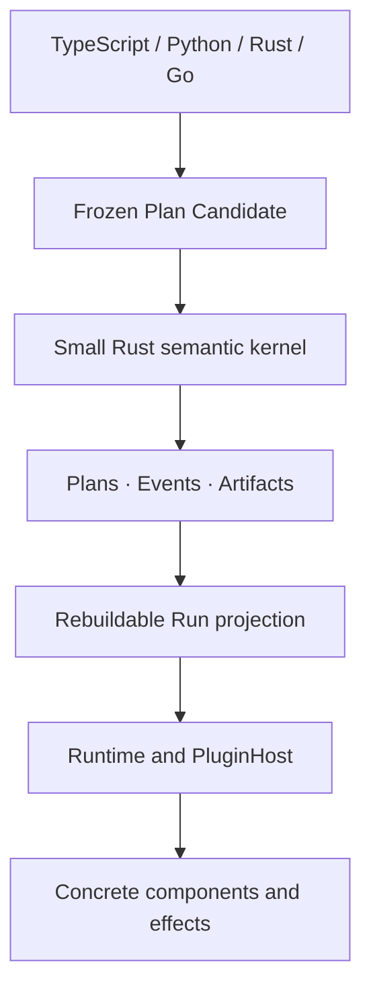

# Cymule

[](https://github.com/cymule-framework/cymule/actions/workflows/ci.yml)

Cymule is a semantic execution fabric for long-running programs that execute
code, wait, recurse over large bodies of work, affect external systems, accept
live intervention, and evolve while they are still running.

Its purpose is to keep one live computation coherent when durability,
transactional state, ambiguous world effects, authority, replay and historical
forks, large virtual work, and live Plan evolution interact. Cymule's central
runtime object is a **versioned effectful continuation**: durable,
version-bound execution state that carries Plan identity, typed state, waits,
scope, outstanding effect obligations, authority, budget, causal position, and
a fencing epoch.

The public model stays deliberately small - `Flow -> Run -> Result`, with
`call / wait / effect / scope` inside a Flow and `observe / decide / change`
around a Run. Under that facade, immutable Plans, causal Events, and Artifacts
are the only canonical truth; graphs, frontiers, schedulers, and debugger views
are rebuildable projections. Languages, databases, queues, sandboxes,
providers, and deployment topologies remain replaceable realizations rather
than framework semantics.

> **Project status:** Cymule `0.1.x` is an early executable reference
> implementation of this model, not yet a complete production fabric. The
> bounded M0 semantic profile is implemented; M1-M4 provide fault-tested but
> partial foundations for durable single-domain execution, large virtual work,
> and live evolution. Optional Agent integration is maintained as a plugin. See
> the [roadmap](docs/roadmap.md) for the exact implemented and remaining
> boundaries.

## What Cymule gives you

- **One Flow format across languages.** TypeScript, Python, Rust, and Go SDKs
  produce the same frozen `cymule.ir/1` Plan.
- **Stable program identity.** Validated Plans are canonicalized and assigned a
  content-addressed `PlanId`.
- **Safe command retries.** Repeating the same command returns the original
  receipt; reusing its ID for different work fails.
- **Stale-worker protection.** Attempts are fenced by an epoch, so an older
  worker cannot commit after ownership changes.
- **Honest external effects.** A timeout after dispatch becomes `unknown`, not
  an automatic duplicate operation.
- **Explicit reconciliation.** An ambiguous effect is resolved through its
  original identity, arguments, and plugin binding.
- **Portable resources between Runs.** Pass inline text/JSON/bytes, large
  objects, directories, collections, sandbox snapshots, remote-drive items, or
  public URLs through one versioned Resource Handle without choosing a storage
  provider in the framework.
- **Replaceable integrations.** Plans name abstract operations rather than
  queues, object stores, vendors, endpoints, or credentials.
- **Deterministic state replay.** Canonical Events rebuild the same Run
  projection and digest.

## When to use Cymule

Cymule is designed for programs that may outlive one process or implementation:

- agent and tool workflows with externally visible actions;
- long-running automation with signals, timers, or human input;
- operations that need approval, auditability, or safe retry behavior;
- systems that must change workers or providers without reinterpreting history;
- compiler or SDK frontends that need one language-neutral execution contract;
- runtime research that needs executable semantics rather than scheduler-specific
  behavior.

Cymule is probably not the right layer for a short, pure function or a normal
request/response handler with no durable state or external side effects.

## Optional Agent integration

Cymule does not define an Agent Loop, Session model, message stream, model/tool
turn, or wire protocol. Those are application-domain concerns. The separately
owned [`plugins/agent-interaction`](plugins/agent-interaction/README.md) package
shows how an Agent integration can lower Session updates, input waits, host
occurrences, workspace changes, and finalized streams onto generic Cymule waits,
effects, resources, and M1 application journals. ACP, MCP, A2A, editor, and
provider support belongs in additional plugins above that package, not in
framework core, CLI, or SDK semantics.

## Five-minute quick start

Build and run a complete code-first Flow with Rust 1.97:

```sh
git clone https://github.com/cymule-framework/cymule.git
cd cymule
cargo run -p cymule-example-hello-world -- Ada
```

The example uses the Rust SDK to declare an `example.greet` component and a
commit-gated `example.capture` effect. It seals the Flow, runs both operations
through an in-process plugin, and returns the greeting:

```json
{
  "run_id": "run:hello-world",
  "plan_id": "sha256:...",
  "value": { "message": "Hello, Ada!" },
  "projection_digest": "...",
  "precondition_token": "pre:0:...",
  "effects": ["sha256:..."]
}
```

Open [`src/flow.rs`](examples/hello-world/src/flow.rs) to change program meaning,
[`src/plugin.rs`](examples/hello-world/src/plugin.rs) to replace the concrete
implementation, and [`src/main.rs`](examples/hello-world/src/main.rs) to embed
the runtime in your application.

Then exercise Cymule's most important failure behavior:

```sh
cargo run -p cymule-example-hello-world -- Ada --unknown-once
```

This simulates losing the response after effect dispatch. Cymule records the
outcome as `unknown` and reconciles the original intent instead of creating a
duplicate effect. The [example guide](examples/hello-world/README.md) explains
the execution and suggests useful first modifications.

Contributors can run every SDK and semantic conformance test with:

```sh
./scripts/verify.sh
```

## Author a Flow

A Flow declares contracts and semantic steps. It does not select a concrete
provider.

This TypeScript example calls an abstract echo component, stages a mutating
capture effect, and returns the component result:

```ts
import {
  CliEngine,
  FlowBuilder,
  type EffectProfile,
} from "cymule";

const captureProfile: EffectProfile = {
  mutation: "mutating",
  dispatch: "on_scope_commit",
  reconciliation: "queryable",
  keyed_idempotency: true,
  irreversible: false,
};

const candidate = new FlowBuilder("echo_and_capture", {}, {})
  .component("example.echo", {}, {})
  .effectContract("example.capture", {}, {}, captureProfile)
  .call("call.echo", "example.echo", { kind: "input" }, "echoed")
  .effect(
    "effect.capture",
    "example.capture",
    { kind: "binding", name: "echoed" },
    "primary",
  )
  .finish({ kind: "binding", name: "echoed" });

const engine = new CliEngine("./target/debug/cymule");
const plan = engine.seal(candidate);
const result = engine.run(
  plan,
  { message: "hello" },
  "./path/to/example-plugin",
  "run:example",
);
```

The Python, Rust, and Go SDKs expose the same concepts with idiomatic builders.
All four SDKs send Plan Candidates to the Rust engine; none implements a second
canonicalizer or state reducer.

Version `0.1.x` keeps all SDK sources in this repository. Public package
publication is performed only by the reviewed GitHub Actions release workflow;
local development and verification never publish registry bytes.

## The programming model

The public model is intentionally small:

```text
Flow -> Run -> Result

Inside a Flow: call | wait | effect | scope
```

| Operation | Use it for |
| --- | --- |
| `call` | Calling an abstract component and binding its typed result. |
| `wait` | Suspending for a signal, timer, or typed external input. |
| `effect` | Performing an observation or a world-mutating action. |
| `scope` | Grouping state/evidence decisions and controlling effect release. |

A `Run` is the live handle. It can accumulate state, history, waits, and effect
obligations before it produces a terminal `Result`.

## Pass resources between Runs

Resources are separate from Plans: a Plan describes what a program requires,
while a Resource Handle describes a value and the evidence needed to retrieve
or replay it. The trusted Rust Engine seals Resource Candidates just as it seals
Plans, so every SDK receives the same location-independent `ResourceId`.

```ts
import { CliEngine, ResourceBuilder } from "cymule";

const engine = new CliEngine("./target/debug/cymule");

const note = engine.sealResource(
  ResourceBuilder.text("reviewed input", { purpose: "next-run-input" }),
);

const dataset = engine.sealResource(
  ResourceBuilder.external(
    "directory",
    "application/vnd.example.dataset-directory",
    {
      kind: "content",
      digest: "sha256:...",
      size: 48291,
    },
    [{
      kind: "resolver",
      binding: "binding:dataset-resolver/3",
      reference: "dataset:quarterly-input",
    }],
  ),
);

const handoff = ResourceBuilder.handoff(
  "transfer:analysis-input",
  "run:prepare",
  "run:analyze",
  "input.dataset",
  dataset,
);
```

`inline` and verified `content` Resources carry exact evidence independently of
location; replay still requires retained inline bytes or a usable resolver.
An immutable `version` requires its original resolver binding. A mutable `live`
Resource is intentionally live-only and never advertised as exact replay.
Public URLs must contain no credentials, query, or fragment; private object
stores, remote drives, sandboxes, and signed URLs use opaque resolver plugins.
Directory, collection, and snapshot adapters expose bounded cursor pages, and
large object reads/writes are chunked rather than loaded into memory.

## How Cymule handles failures

| Situation | Cymule behavior |
| --- | --- |
| A command is delivered twice | The same command ID and semantics return the original receipt. |
| A command ID is reused for different work | The command is rejected. |
| The Run changed after a UI or worker read it | The stale precondition returns a typed conflict and the current token. |
| An old Attempt finishes after an epoch change | Its output is fenced and rejected. |
| A scope aborts before effect release | Its unreleased mutating effects are cancelled. |
| Dispatch starts but the response is lost | The effect becomes `unknown`. |
| An unknown effect can be queried | The original effect is reconciled without creating a new intent. |
| Required replay data has been removed | Replay availability is downgraded instead of silently regenerating data. |

## Effects are not ordinary retries

An external operation has three independent states:

```text
control:        admitted -> prepared -> release_authorized -> dispatch_started
world outcome:  unobserved | applied | not_applied | unknown
reconciliation: not_required | pending | resolved | governance_required
```

If a network timeout happens after dispatch, Cymule does not know whether the
external world changed. Retrying as a new operation could duplicate a payment,
message, deployment, or tool action. Cymule therefore records `unknown` and
keeps reconciliation attached to the original effect identity.

When a scope commits, it commits the internal decision and transfers unresolved
world actions into effect obligations. It does not pretend those actions are
already settled. Blocking obligations must reach an authoritative terminal
outcome before the Run can complete.

## Plans stay portable

Cymule separates program meaning from concrete realization:

```text
Plan                              Binding and plugin
--------------------------------  ---------------------------------
stable sites and operation IDs    implementation identity
input/output schemas              implementation revision
effect safety properties          credentials and endpoints
scope and result structure        worker and deployment topology
```

A Binding Context supplies defaults for future occurrences. An admitted
Attempt or Effect keeps its original occurrence binding even when defaults
change. This makes worker upgrades, canaries, and provider migration possible
without rewriting history.

Plans should name abstract operations such as `document.read` or
`notification.send`. Concrete databases, buckets, queues, model vendors,
credentials, and network endpoints belong behind plugins or runtime substrate
interfaces.

## Architecture at a glance



Only `cymule-core` owns canonical identity, command admission, transition laws,
and replay. It performs no network, filesystem, clock, random, model, tool,
queue, or database I/O.

The framework has three canonical authorities:

1. immutable, content-addressed Plans;
2. admitted causal Events;
3. immutable typed Artifacts.

Current Run state, ready-work queues, graphs, indexes, and attention views are
rebuildable projections rather than competing sources of truth.

See [Architecture](docs/architecture.md) and the
[Semantic specification](docs/specification.md) for the detailed design.

## SDK and tooling support

| Surface | Status | Notes |
| --- | --- | --- |
| Rust SDK | Implemented | Native builder, typed contracts, and `Engine` trait. |
| TypeScript SDK | Implemented | Builder and CLI-backed engine client. |
| Python SDK | Implemented | Dependency-light builder and engine client. |
| Go SDK | Implemented | Builder and engine client. |
| Cross-Run Resources | Implemented foundation | Four SDK builders, Rust sealing, bounded resolver/store interfaces, M1 handoff journal. |
| Agent interaction plugin | Optional, partial | Rust plugin with Session, occurrence, input, workspace, and stream conformance tests. |
| Process plugin protocol | Implemented | JSON request/response reference transport. |
| JSON Schema contracts | Implemented | Draft 2020-12 Plan and protocol schemas. |
| MLIR workbench | Partial | Generic-operation syntax and MLIR 22 smoke validation. |

The process protocol is intentionally simple and useful for local integration.
It is not the only possible production transport. Future WIT or network
transports can implement the same `PluginHost` behavior.

Public packages and release artifacts are produced only by GitHub Actions after
repository verification and staged-byte inspection. npm packages use trusted
publishing and provenance; local development commands never publish releases.

## Current capabilities and limits

Version `0.1.x` implements the bounded Semantic Interpreter M0 and Embedded M0
profiles. M1 through M4 have useful, tested foundations but remain partial and
are not advertised as complete conformance profiles.

Implemented today:

- frozen IR validation and canonical Plan IDs;
- in-memory Plan, Event, and Artifact stores;
- typed Commands, idempotency, and stale-action preconditions;
- causal state replay and projection digest verification;
- Attempt epoch fencing;
- scope, effect, obligation, and reconciliation state machines;
- future-default binding updates with pinned Attempt and Effect bindings;
- one-shot process plugins and four SDK execution chains;
- durable whole-state CAS, complete Continuations, waits, leases, outbox, and
  component occurrence replay;
- process reopen after a durable wait without reinvoking a recorded component;
- ambiguous mutating-effect recovery by reconciliation without redispatch;
- an optional Agent interaction plugin with M1-backed Session/input replay,
  binding-pinned host occurrences, workspace scope integration, and finalized
  streams; none of these types enter the framework core or main SDKs;
- provider-neutral cross-Run Resource Handles for inline values, objects,
  directories, collections, snapshots, remote references, and public URLs;
- bounded resolver/store interfaces and durable idempotent M1 handoffs, with
  one shared Resource ID sealed through all four SDKs;
- bounded virtual work with deterministic fairness and portable snapshots;
- immutable Plan evolution DAGs, impact cones, canaries, rollback pins,
  migration receipts, and shadow evidence.

Not yet claimed:

- complete nested-scope durable interpretation and every crash window;
- production resource resolver/store plugins and automatic interpreter
  activation of incoming handoffs;
- durable virtual-work partition migration and subtree rehydration;
- automatic live-evolution diffing, shadow execution, observation gates, and
  mixed-version dispatch;
- distributed ownership, consensus, scheduling, and failover;
- strong untrusted-code or multi-tenant isolation;
- provider-level exactly-once guarantees;
- a registered MLIR dialect and deterministic MLIR-to-Plan lowering.

M0 proves exact canonical **state replay** over retained Events and required
Artifacts. Partial M1 additionally proves resume and exact execution replay
only where a component occurrence was durably recorded. Neither claim implies
distributed consensus or provider-level exactly-once behavior.

See [Conformance](docs/conformance.md) for precise profile claims and
[Roadmap](docs/roadmap.md) for the implementation sequence.

## Repository layout

```text
crates/cymule-core      trusted Rust semantic kernel
crates/cymule-durable   provider-neutral M1 persistence and recovery contracts
crates/cymule-evolution provider-neutral M4 Plan DAG and rollout semantics
crates/cymule-runtime   embedded interpreter and plugin host
crates/cymule-resource  provider-neutral Resource Handles and Run handoffs
crates/cymule-sdk       native Rust authoring and engine facade
crates/cymule-virtual   provider-neutral M3 bounded virtual-work scheduler
crates/cymule-cli       command-line and JSON engine boundary
sdk/typescript          TypeScript SDK
sdk/python              Python SDK
sdk/go                  Go SDK
schemas                 frozen JSON Schema contracts
compiler/mlir           optional, partial MLIR workbench
examples/hello-world    code-first Flow, Embedded runtime, and example plugin
plugins/test-adapter    deterministic conformance plugin
plugins/directory-store atomic local M1 DurableStore reference adapter
plugins/agent-interaction optional Agent-domain integration plugin
tests                   shared fixtures and conformance assets
docs                    specification, architecture, and decisions
scripts                 complete repository verification
```

## Learn more

- [Semantic specification](docs/specification.md) — canonical objects,
  Commands, scopes, effects, bindings, and replay.
- [Architecture](docs/architecture.md) — trust boundary, compiler/runtime split,
  plugins, and durable storage interfaces.
- [Conformance](docs/conformance.md) — implemented profiles and fault-oriented
  test cases.
- [Research landscape](docs/research-landscape.md) — similarities and deliberate
  differences from maintained execution systems and standards.
- [Roadmap](docs/roadmap.md) — durable execution, agent integration, large
  virtual work, live evolution, isolation, and formalization.
- [ADR 0001](docs/decisions/0001-small-rust-kernel.md) — why the authoritative
  kernel is small and Rust-first.
- [ADR 0002](docs/decisions/0002-mlir-outside-core.md) — why MLIR stays outside
  the runtime core.

## Contributing

Read [CONTRIBUTING.md](CONTRIBUTING.md) and the nearest `AGENTS.md` before making
changes. A semantic change must update its version-domain decision,
specification, schemas, conformance tests, and affected SDK fixtures together.

Report security issues through the private process in
[SECURITY.md](SECURITY.md).

## License

Licensed under either the Apache License, Version 2.0 or the MIT License, at your
option.
