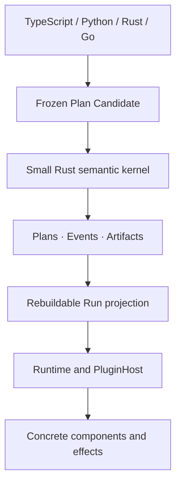

# Cymule

[](https://github.com/cymule-framework/cymule/actions/workflows/ci.yml)

Cymule is a semantic execution fabric for programs that must remain correct
across suspension, retries, external side effects, worker changes, historical
replay, and live evolution.

Its purpose is to keep one live computation coherent when durability,
transactional state, ambiguous world effects, authority, replay and historical
forks, large virtual work, and live Plan evolution interact. Cymule's central
runtime object is a **versioned effectful continuation**: durable,
version-bound execution state that carries Plan identity, typed state, waits,
scope, outstanding effect obligations, authority, budget, causal position, and
a fencing epoch.

The public model stays deliberately small - `Flow -> Run -> Result`, with
`call / wait / effect / scope` inside a Flow and `observe / decide / change`
around a Run. Under that facade, immutable Plans, causal Events, and Artifacts
are the only canonical truth; graphs, frontiers, schedulers, and debugger views
are rebuildable projections. Languages, databases, queues, sandboxes,
providers, and deployment topologies remain replaceable realizations rather
than framework semantics.

> **Project status:** Cymule `0.1.x` is an early executable reference
> implementation of this model, not yet a complete production fabric. The
> exact semantic kernel, bounded virtual-work scheduler, and provider-neutral
> live-evolution controls are executable today. Single-domain durable execution
> is fault-tested but remains partial. Optional Agent integration is maintained
> as a plugin. See
> the [roadmap](docs/roadmap.md) for the exact implemented and remaining
> boundaries.

## What Cymule gives you

- **One Flow format across languages.** TypeScript, Python, Rust, and Go SDKs
  produce the same frozen `cymule.ir/2` Plan, including reusable definition
  declaration and invocation.
- **Stable program identity.** Validated Plans are canonicalized and assigned a
  content-addressed `PlanId`.
- **Safe command retries.** Repeating the same command returns the original
  receipt; reusing its ID for different work fails.
- **Stale-worker protection.** Attempts are fenced by an epoch, so an older
  worker cannot commit after ownership changes.
- **Identified durable wake-ups.** Signal and timer deliveries carry stable
  activation identities, so redelivery is idempotent and consume-once winners
  are decided by durable CAS rather than worker timing.
- **Honest external effects.** A timeout after dispatch becomes `unknown`, not
  an automatic duplicate operation.
- **Explicit reconciliation.** An ambiguous effect is resolved through its
  original identity, arguments, and plugin binding.
- **Portable resources between Runs.** Pass inline text/JSON/bytes, large
  objects, directories, collections, sandbox snapshots, remote-drive items, or
  public URLs through one versioned Resource Handle without choosing a storage
  provider in the framework.
- **Replaceable integrations.** Plans name abstract operations rather than
  queues, object stores, vendors, endpoints, or credentials.
- **Deterministic state replay.** Canonical Events rebuild the same Run
  projection and digest.
- **Safe reusable evolution.** Logical module references follow the newest
  compatible revision by default when a new Plan is linked, while every sealed
  Plan and admitted occurrence remains immutable and replayable.

## When to use Cymule

Cymule is designed for programs that may outlive one process or implementation:

- agent and tool workflows with externally visible actions;
- long-running automation with signals, timers, or human input;
- operations that need approval, auditability, or safe retry behavior;
- systems that must change workers or providers without reinterpreting history;
- compiler or SDK frontends that need one language-neutral execution contract;
- runtime research that needs executable semantics rather than scheduler-specific
  behavior.

Cymule is probably not the right layer for a short, pure function or a normal
request/response handler with no durable state or external side effects.

## Optional Agent integration

Cymule does not define an Agent Loop, Session model, message stream, model/tool
turn, or wire protocol. Those are application-domain concerns. The separately
owned [`plugins/agent-interaction`](plugins/agent-interaction/README.md) package
shows how an Agent integration can lower Session updates, input waits, host
occurrences, workspace changes, and finalized streams onto generic Cymule waits,
effects, resources, and durable application journals. ACP, MCP, A2A, editor, and
provider support belongs in additional plugins above that package, not in
framework core, CLI, or SDK semantics.

## Official plugins

Cymule ships a day-one adapter set without making any provider canonical:

- SQLite and atomic-directory durable stores;
- content-addressed filesystem and Apache `object_store` Resources;
- acknowledgement-coupled HTTP signals and durable logical timers;
- a bounded process executor;
- composable OpenTelemetry/OTLP observation;
- official RMCP tool mapping above the optional Agent contracts.

Every adapter is an independent crate with focused fault and boundary tests.
See the [official plugin catalog](docs/plugins.md) for exact guarantees,
limitations, mature dependencies, and the RocksDB assessment.

## How live evolution works

Application source can reference a reusable module with
`latest_compatible` (the default) or pin one exact revision. `latest` is an
authoring convenience, never a runtime pointer:

1. Cymule resolves the complete acyclic module dependency closure.
2. It records every selected revision and seals them into a new immutable Plan.
3. Publishing a compatible leaf revision relinks affected future parent Plans;
   a newly reachable component, effect, wait, capability, or authority
   requirement blocks automatic takeover and retains the prior head.
4. Existing Runs and occurrences keep their original Plan; history is not
   rewritten.
5. New work can advance through shadow, deterministic canary, promotion, or
   rollback decisions backed by immutable observations.

When state must cross Plan versions, Cymule derives a content-addressed proof
from a ready, root-scoped durable Continuation with no waits, effect obligations,
or authority leases. A pinned migration plugin supplies the transformed
Artifact and evidence only after that proof matches durable authority. An
explicit `restart_under_new_plan` authorization can instead start a distinct
replacement Run under an exact Plan without reinterpreting old state.
Shadow execution,
metrics, deployment, and traffic movement are also replaceable plugins; Cymule
owns only their contracts, immutable receipts, and deterministic admission
rules. TypeScript, Python, Rust, and Go expose the same
`cymule.evolution-control/2` transport commands without duplicating the Rust
controller.

## Five-minute quick start

Imagine a team evaluating hundreds of support cases through a model, Agent, or
rules engine. The run is expensive and may last for hours. Halfway through:

- a worker process crashes;
- the team ships a better scoring policy;
- a later policy change is incompatible with the running evaluation.

Without durable, versioned execution, the team must choose between repeating
expensive completed work, maintaining its own recovery database, or accepting
results whose meaning changed halfway through the run.

Cymule keeps completed work, applies a compatible update only to work that has
not started, and rejects an incompatible update before it changes the run. Try
the complete scenario locally with Rust 1.97:

```sh
git clone https://github.com/cymule-framework/cymule.git
cd cymule
cargo run -p cymule-example-durable-evaluation-campaign -- demo
```

The demo runs real work, stops the worker after three results, upgrades the
scoring policy, resumes the evaluation, and tries an unsafe update:

```text
Cymule: safely upgrade a running evaluation

Scenario        Evaluate 12 support tickets while the scoring policy changes.
✓ Crash recovery  The worker stopped after 3 results; restart reused all 3.
✓ Safe upgrade    3 completed results kept the original policy;
                  9 future results used the update.
✓ Compatibility   An incompatible scoring update was blocked before it changed work.
✓ Outcome         12/12 finished without repeating completed evaluations.
```

What this gives an application:

- **No duplicate cost after a crash.** Finished model calls, tool executions,
  or batch items do not run again merely because the worker restarted.
- **Comparable historical results.** Every result keeps the exact program and
  policy that produced it, so an upgrade cannot rewrite history.
- **Safe changes during long-running work.** Compatible updates can serve new
  work immediately; incompatible changes fail before silently taking over.
- **Replaceable execution.** The evaluator can be a model gateway, Agent,
  script, sandbox, or remote service without moving its internal loop into the
  framework.
- **Provider-neutral recovery.** The application is not coupled to a particular
  queue, database, object store, or model provider.

The bundled evaluator is deterministic, so the tour needs no account, model,
network service, or container.

The command prints the retained state directory. The
[campaign guide](examples/durable-evaluation-campaign/README.md) expands each
phase into individual commands, and its
[adversarial review](examples/durable-evaluation-campaign/ADVERSARIAL_REVIEW.md)
documents the crash and integrity boundaries.

To see how Cymule avoids repeating an external action when the provider applies
it but its response is lost, run:

```sh
cargo run -p cymule-example-hello-world -- Ada --unknown-once
```

The example checks what happened to the original action instead of blindly
sending it again.

Install the published Rust facade and engine CLI when embedding Cymule in your
own application:

```sh
cargo add cymule
cargo install cymule-cli
```

## Development

Contributors should first select the smallest conservative suite for their
change:

```sh
python3 scripts/test_harness.py plan --base origin/main
```

Profile claims and release changes run every required SDK and semantic
conformance family with:

```sh
./scripts/verify.sh
```

## Author a Flow

A Flow declares contracts and semantic steps. It does not select a concrete
provider.

This TypeScript example calls an abstract echo component, stages a mutating
capture effect, and returns the component result:

```ts
import {
  CliEngine,
  FlowBuilder,
  type EffectProfile,
} from "cymule";

const captureProfile: EffectProfile = {
  mutation: "mutating",
  dispatch: "on_scope_commit",
  reconciliation: "queryable",
  keyed_idempotency: true,
  irreversible: false,
};

const candidate = new FlowBuilder("echo_and_capture", {}, {})
  .component("example.echo", {}, {})
  .effectContract("example.capture", {}, {}, captureProfile)
  .call("call.echo", "example.echo", { kind: "input" }, "echoed")
  .effect(
    "effect.capture",
    "example.capture",
    { kind: "binding", name: "echoed" },
    "primary",
  )
  .finish({ kind: "binding", name: "echoed" });

const engine = new CliEngine("./target/debug/cymule");
const plan = engine.seal(candidate);
const result = engine.run(
  plan,
  { message: "hello" },
  "./path/to/example-plugin",
  "run:example",
);
```

The Python, Rust, and Go SDKs expose the same concepts with idiomatic builders.
All four SDKs send Plan Candidates to the Rust engine; none implements a second
canonicalizer or state reducer.

Version `0.1.x` keeps all SDK sources in this repository. The Rust facade is
published as `cymule`, the CLI as `cymule-cli`, and advanced profile/plugin
crates retain their `cymule-*` names. TypeScript is published as both `cymule`
and `@cymule/sdk`. Public package publication is performed only by reviewed
GitHub Actions release workflows; local development and verification never
publish registry bytes.

## The programming model

The public model is intentionally small:

```text
Flow -> Run -> Result

Inside a Flow: call | wait | effect | scope
```

| Operation | Use it for |
| --- | --- |
| `call` | Calling an abstract component and binding its typed result. |
| `wait` | Suspending for a signal, timer, or typed external input. |
| `effect` | Performing an observation or a world-mutating action. |
| `scope` | Grouping state/evidence decisions and controlling effect release. |

A `Run` is the live handle. It can accumulate state, history, waits, and effect
obligations before it produces a terminal `Result`.

## Pass resources between Runs

Resources are separate from Plans: a Plan describes what a program requires,
while a Resource Handle describes a value and the evidence needed to retrieve
or replay it. The trusted Rust Engine seals Resource Candidates just as it seals
Plans, so every SDK receives the same location-independent `ResourceId`.

```ts
import { CliEngine, ResourceBuilder } from "cymule";

const engine = new CliEngine("./target/debug/cymule");

const note = engine.sealResource(
  ResourceBuilder.text("reviewed input", { purpose: "next-run-input" }),
);

const dataset = engine.sealResource(
  ResourceBuilder.external(
    "directory",
    "application/vnd.example.dataset-directory",
    {
      kind: "content",
      digest: "sha256:...",
      size: 48291,
    },
    [{
      kind: "resolver",
      binding: "binding:dataset-resolver/3",
      reference: "dataset:quarterly-input",
    }],
  ),
);

const handoff = ResourceBuilder.handoff(
  "transfer:analysis-input",
  "run:prepare",
  "run:analyze",
  "input.dataset",
  dataset,
);
```

`inline` and verified `content` Resources carry exact evidence independently of
location; replay still requires retained inline bytes or a usable resolver.
An immutable `version` requires its original resolver binding. A mutable `live`
Resource is intentionally live-only and never advertised as exact replay.
Public URLs must contain no credentials, query, or fragment; private object
stores, remote drives, sandboxes, and signed URLs use opaque resolver plugins.
Directory, collection, and snapshot adapters expose bounded cursor pages, and
large object reads/writes are chunked rather than loaded into memory.

## How Cymule handles failures

| Situation | Cymule behavior |
| --- | --- |
| A command is delivered twice | The same command ID and semantics return the original receipt. |
| A command ID is reused for different work | The command is rejected. |
| The Run changed after a UI or worker read it | The stale precondition returns a typed conflict and the current token. |
| An old Attempt finishes after an epoch change | Its output is fenced and rejected. |
| A signal or timer delivery is retried | The original activation receipt is retained; conflicting reuse fails. |
| A scope aborts before effect release | Its unreleased mutating effects are cancelled. |
| Dispatch starts but the response is lost | The effect becomes `unknown`. |
| An unknown effect can be queried | The original effect is reconciled without creating a new intent. |
| Required replay data has been removed | Replay availability is downgraded instead of silently regenerating data. |

## Effects are not ordinary retries

An external operation has three independent states:

```text
control:        admitted -> prepared -> release_authorized -> dispatch_started
world outcome:  unobserved | applied | not_applied | unknown
reconciliation: not_required | pending | resolved | governance_required
```

If a network timeout happens after dispatch, Cymule does not know whether the
external world changed. Retrying as a new operation could duplicate a payment,
message, deployment, or tool action. Cymule therefore records `unknown` and
keeps reconciliation attached to the original effect identity.

When a scope commits, it commits the internal decision and transfers unresolved
world actions into effect obligations. It does not pretend those actions are
already settled. Blocking obligations must reach an authoritative terminal
outcome before the Run can complete.

## Plans stay portable

Cymule separates program meaning from concrete realization:

```text
Plan                              Binding and plugin
--------------------------------  ---------------------------------
stable sites and operation IDs    implementation identity
input/output schemas              implementation revision
effect safety properties          credentials and endpoints
scope and result structure        worker and deployment topology
```

A Binding Context supplies defaults for future occurrences. An admitted
Attempt or Effect keeps its original occurrence binding even when defaults
change. This makes worker upgrades, canaries, and provider migration possible
without rewriting history.

Plans should name abstract operations such as `document.read` or
`notification.send`. Concrete databases, buckets, queues, model vendors,
credentials, and network endpoints belong behind plugins or runtime substrate
interfaces.

## Architecture at a glance



Only `cymule-core` owns canonical identity, command admission, transition laws,
and replay. It performs no network, filesystem, clock, random, model, tool,
queue, or database I/O.

The framework has three canonical authorities:

1. immutable, content-addressed Plans;
2. admitted causal Events;
3. immutable typed Artifacts.

Current Run state, ready-work queues, graphs, indexes, and attention views are
rebuildable projections rather than competing sources of truth.

See [Architecture](docs/architecture.md) and the
[Semantic specification](docs/specification.md) for the detailed design.

## SDK and tooling support

| Surface | Status | Notes |
| --- | --- | --- |
| Rust SDK | Implemented | Native builder, typed contracts, and `Engine` trait. |
| TypeScript SDK | Implemented | Builder and CLI-backed engine client. |
| Python SDK | Implemented | Dependency-light builder and engine client. |
| Go SDK | Implemented | Builder and engine client. |
| Cross-Run Resources | Implemented foundation | Four SDK builders, Rust sealing, bounded resolver/store interfaces, durable handoff journal, and atomic input activation. |
| Durable wait activation | Implemented foundation | Identified signal/timer records, bounded parked indexes, replaceable source drivers, acknowledgement-loss replay, reopen-safe epoch advance, and four SDK wire validation. |
| Durable effect policies | Implemented foundation | Nested commit gates, eager observation binding, explicit caller release, exact outbox deltas, and ambiguity reconciliation. |
| Large virtual work | Implemented | Bounded materialization, weighted fairness, verified cursor migration, certified cold compaction/partial rehydration, fenced multi-worker recovery, durable checkpoints, and four SDK controls. |
| Virtual work control | Implemented | Binding-pinned attempts, work/lease fencing, explicit recovery, closed dispositions, and four SDK transport interfaces. |
| Live evolution | Implemented foundation | Deterministic Plan diff/DAG, compatible future relinking, durable occurrence pins, safe-point migration receipts, shadow evidence, canary gates, and rollback. |
| Agent interaction plugin | Optional, partial | Rust plugin with Session, occurrence, input, workspace, and stream conformance tests. |
| Process plugin protocol | Implemented | JSON request/response reference transport. |
| JSON Schema contracts | Implemented | Draft 2020-12 Plan and protocol schemas. |
| MLIR workbench | Partial | Generic-operation syntax and MLIR 22 smoke validation. |

The process protocol is intentionally simple and useful for local integration.
It is not the only possible production transport. Future WIT or network
transports can implement the same `PluginHost` behavior.

Public packages and release artifacts are produced only by GitHub Actions after
repository verification and staged-byte inspection. npm packages use trusted
publishing and provenance; local development commands never publish releases.

## Capabilities and limits

Today Cymule provides:

- **Exact semantic execution:** sealed Plans, canonical identities, typed
  idempotent Commands, causal replay, fenced attempts and effects, and explicit
  reconciliation of ambiguous outcomes.
- **Durable single-domain execution (partial):** CAS state,
  Continuations, waits, outbox records, component occurrences, compaction, and
  acknowledgement-loss recovery.
- **Large virtual work:** bounded materialization, deterministic fairness,
  portable snapshots, verified region changes, cold-history archival, and
  fenced worker leases.
- **Live evolution:** immutable Plan DAGs, latest-compatible reusable-module
  linking, future-only rollout, safe-point migration, shadow evidence, and
  deterministic promotion or rollback.

Provider-neutral Resource and Agent interfaces, official adapters, and the
TypeScript, Python, Rust, and Go SDKs sit above these semantics. Agent Loops,
model behavior, infrastructure topology, and provider policy remain outside the
framework core.

Cymule does not claim distributed consensus or failover, strong multi-tenant
isolation, provider-level exactly-once behavior, production certification for
every adapter, or a complete MLIR dialect and lowering pipeline. Exact replay
requires retained Events and Artifacts; exact execution replay additionally
requires a durably recorded component occurrence.

See [Conformance](docs/conformance.md) for precise behavioral claims and
[Roadmap](docs/roadmap.md) for the implementation sequence.

## Repository layout

```text
crates/cymule-core      trusted Rust semantic kernel
crates/cymule-durable   provider-neutral persistence and recovery contracts
crates/cymule-evolution provider-neutral Plan DAG and rollout semantics
crates/cymule-runtime   embedded interpreter and plugin host
crates/cymule-resource  provider-neutral Resource Handles and Run handoffs
crates/cymule-sdk       native Rust facade, published as the `cymule` crate
crates/cymule-virtual   provider-neutral bounded virtual-work scheduler
crates/cymule-cli       command-line and JSON engine boundary
sdk/typescript          TypeScript SDK
sdk/python              Python SDK
sdk/go                  Go SDK
schemas                 frozen JSON Schema contracts
compiler/mlir           optional, partial MLIR workbench
examples/hello-world    code-first Flow, Embedded runtime, and example plugin
examples/durable-evaluation-campaign durable recovery/evolution user path
plugins/test-adapter    deterministic conformance plugin
plugins/directory-store atomic local DurableStore reference adapter
plugins/agent-interaction optional Agent-domain integration plugin
plugins/store-sqlite    SQLite single-domain DurableStore adapter
plugins/resource-fs     content-addressed files and directory manifests
plugins/resource-object-store Apache object_store Resource adapter
plugins/activation-http ack-after-CAS signal ingress
plugins/activation-timer durable logical timer source
plugins/executor-process bounded process plugin transport
plugins/observability-otel derived tracing and OTLP export
plugins/agent-mcp       official RMCP tool adapter, without an Agent Loop
tests                   shared fixtures and conformance assets
docs                    specification, architecture, and decisions
scripts                 complete repository verification
```

## Learn more

- [Semantic specification](docs/specification.md) — canonical objects,
  Commands, scopes, effects, bindings, and replay.
- [Architecture](docs/architecture.md) — trust boundary, compiler/runtime split,
  plugins, and durable storage interfaces.
- [Conformance](docs/conformance.md) — implemented profiles and fault-oriented
  test cases.
- [Research landscape](docs/research-landscape.md) — similarities and deliberate
  differences from maintained execution systems and standards.
- [Roadmap](docs/roadmap.md) — durable execution, agent integration, large
  virtual work, live evolution, isolation, and formalization.
- [Releasing](docs/releasing.md) — immutable npm and crates.io publication.
- [Official plugins](docs/plugins.md) — day-one adapters and provider boundaries.
- [ADR 0001](docs/decisions/0001-small-rust-kernel.md) — why the authoritative
  kernel is small and Rust-first.
- [ADR 0002](docs/decisions/0002-mlir-outside-core.md) — why MLIR stays outside
  the runtime core.

## Contributing

Read [CONTRIBUTING.md](CONTRIBUTING.md) and the nearest `AGENTS.md` before making
changes. A semantic change must update its version-domain decision,
specification, schemas, conformance tests, and affected SDK fixtures together.

Report security issues through the private process in
[SECURITY.md](SECURITY.md).

## License

Licensed under either the Apache License, Version 2.0 or the MIT License, at your
option.
