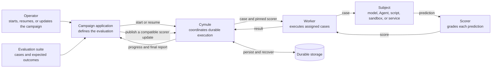

# Durable Evaluation Campaign

This example answers a practical question: what happens when a long-running,
expensive evaluation loses its worker while the team is also changing how
results are scored?

The bundled workload classifies support tickets so it stays fast,
credential-free, and deterministic. During the tour, the worker stops after
three results, the scoring policy is upgraded, the run resumes, and an unsafe
follow-up update is rejected. A real evaluator can be a model gateway,
MCP-backed Agent, script, sandbox, or remote service.

## How the participants collaborate



The campaign application decides what should be evaluated. Cymule coordinates
the work and recovery while treating the worker, subject, scorer, and storage as
replaceable collaborators. It does not interpret a model or Agent's internal
loop. A compatible scorer update applies to later assignments, while already
assigned or completed cases keep their original scorer.

## Run the complete feature tour

For the shortest path, run one command from the repository root:

```sh
cargo run -p cymule-example-durable-evaluation-campaign -- demo
```

The tour prints a short proof that completed evaluations were not repeated,
finished results kept their original scoring policy, future results used the
compatible update, and an incompatible update changed nothing. It also prints
the temporary state directory for inspection. To choose that directory
yourself, it must not already exist:

```sh
cargo run -p cymule-example-durable-evaluation-campaign -- \
  demo --state /tmp/cymule-feature-tour
```

## Run the campaign

From the repository root:

```sh
cargo build -p cymule-example-durable-evaluation-campaign

CAMPAIGN_STATE=$(mktemp -d)

./target/debug/cymule-example-durable-evaluation-campaign run \
  --state "$CAMPAIGN_STATE" \
  --suite examples/durable-evaluation-campaign/fixtures/support-tickets.jsonl \
  --run-id run:support-evaluation
```

The JSON report includes the location-independent suite Resource ID, the Plan
selected for future work, aggregate points, and one terminal record per case:

```json
{
  "run_id": "run:support-evaluation",
  "suite_resource_id": "sha256:...",
  "current_plan_id": "sha256:...",
  "total_cases": 12,
  "total_occurrences": 12,
  "recovered_attempts": 0,
  "succeeded": 12,
  "failed": 0,
  "points": 24,
  "max_points": 24,
  "cases": [
    {
      "case_id": "account-locked",
      "occurrence_id": "sha256:...",
      "plan_id": "sha256:...",
      "state": "succeeded",
      "output": {
        "prediction": { "category": "identity", "urgency": "normal" },
        "score": { "policy": "strict", "points": 2, "max_points": 2, "passed": true }
      }
    }
  ]
}
```

Read the same durable projection without executing work:

```sh
./target/debug/cymule-example-durable-evaluation-campaign status \
  --state "$CAMPAIGN_STATE" \
  --run-id run:support-evaluation
```

`status` re-verifies the retained suite bytes against their Resource Handle.
Supplying `--suite FILE` additionally proves that a local file is byte-for-byte
the suite originally pinned by this campaign.

## See crash recovery and live evolution

Start a fresh campaign and terminate the process after three terminal result
checkpoints. Exit code `75` is deliberate:

```sh
EVOLUTION_STATE=$(mktemp -d)

./target/debug/cymule-example-durable-evaluation-campaign run \
  --state "$EVOLUTION_STATE" \
  --suite examples/durable-evaluation-campaign/fixtures/support-tickets.jsonl \
  --run-id run:evolving-evaluation \
  --simulate-crash-after-commit 3 || test "$?" -eq 75
```

Publish a compatible scorer revision:

```sh
./target/debug/cymule-example-durable-evaluation-campaign evolve \
  --state "$EVOLUTION_STATE" \
  --run-id run:evolving-evaluation \
  --policy weighted
```

Resume with the same suite and Run identity:

```sh
./target/debug/cymule-example-durable-evaluation-campaign run \
  --state "$EVOLUTION_STATE" \
  --suite examples/durable-evaluation-campaign/fixtures/support-tickets.jsonl \
  --run-id run:evolving-evaluation
```

The first three cases retain the strict scorer's Plan ID. Later cases use the
new weighted scorer and a new Plan ID. `latest_compatible` therefore behaves as
an automatic default for future work, not a mutable pointer inside history.

Try a revision with a changed input contract:

```sh
./target/debug/cymule-example-durable-evaluation-campaign evolve \
  --state "$EVOLUTION_STATE" \
  --run-id run:evolving-evaluation \
  --policy incompatible
```

The revision is retained, but `advanced` is `false`; compatibility admission
keeps the previous future-default Plan.

## Why this matters

| Operational problem | What the example proves | Advantage |
| --- | --- | --- |
| A worker dies midway through expensive work | Restart continues from completed results | No unnecessary repeated model calls or batch work |
| A scoring policy changes during a run | Completed results keep the old policy; future results use the compatible update | Results remain comparable and upgrades do not require downtime |
| A new policy changes the expected contract | The update is rejected before it handles future work | Unsafe changes cannot silently corrupt a running campaign |
| An evaluation may contain a very large number of cases | Only a bounded amount of ready work is held at once | Predictable memory use without materializing the full campaign |
| Teams change models, Agents, or execution environments | The evaluator is replaceable behind one interface | Recovery and evolution logic does not become provider-specific |

This local example accepts suites up to 8 MiB and 100,000 cases. Production
sources can page over databases, object stores, APIs, or generated work without
changing the application-level behavior demonstrated here.

## Replace the deterministic subject

The binary launches itself in process-plugin mode only to make the default
experience self-contained. To integrate a real evaluator, keep the published
component contracts and pass an executable implementing `cymule.plugin/1`:

```sh
./target/debug/cymule-example-durable-evaluation-campaign run \
  --state "$CAMPAIGN_STATE" \
  --suite examples/durable-evaluation-campaign/fixtures/support-tickets.jsonl \
  --run-id run:external-subject \
  --plugin /absolute/path/to/evaluation-plugin
```

The example invokes that executable with `__plugin`, an empty ambient
environment, a five-second timeout, and a one-MiB protocol-message limit:

- `example.ticket-subject` receives one typed case and returns a prediction;
- `example.ticket-scorer` receives the case, prediction, and Plan-pinned policy;
- `Describe` returns immutable implementation and operation revisions.

For a different domain, replace the fixture types and component names in this
example application. The durable store, Resource, scheduler, lease, occurrence,
and evolution interfaces do not depend on tickets or on any Agent protocol.

The bundled subject is pure and safe to invoke again if a worker dies before a
result checkpoint. Do not put a mutating operation behind this component and
assume retries are safe. Model real world mutations as Cymule Effects with a
provider idempotency key and authoritative reconciliation.

## Failure drills and limits

The focused test suite exercises:

```sh
cargo test -p cymule-example-durable-evaluation-campaign
```

It covers process exit after a committed result, expiry and explicit recovery
after exit with an active claim, refusal to steal an unexpired claim, changed
suite bytes, retained Resource tampering, duplicate case IDs, unknown fields,
symlink input, compatible future-only evolution, and incompatible-update
blocking. A separate Unix black-box test runs a 24-case campaign through a
protocol-compatible slow process plugin, observes committed progress through a
read-only SQLite connection, sends an external process kill, reopens authority,
recovers at most one expired claim, and proves one terminal result per case.
See [ADVERSARIAL_REVIEW.md](ADVERSARIAL_REVIEW.md) for the reviewed failure
model and remaining boundaries.

This is a single-domain reference application. It does not claim distributed
consensus, remote failover, untrusted-code isolation, or provider-level exactly
once behavior. The process executor enforces argument, environment, timeout,
and message bounds; it is not a sandbox.
